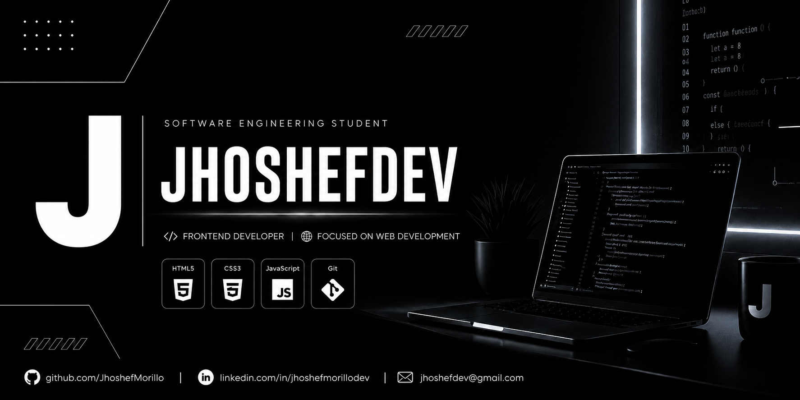

  

<h1>Hi, I'm Jhoshef 👋</h1>
<h3>Software Engineering Student • Aspiring Full Stack Developer</h3>

 

<h2 align="left">💫 About Me</h2>

I'm a Software Engineering student from Peru, currently focused on Frontend Development 
as the first step toward becoming a Full Stack Developer.  
I enjoy turning ideas into real, working projects — building interfaces that are 
clean, responsive, and easy to use.  
Right now I'm strengthening my foundations in <strong>HTML, CSS, and JavaScript</strong>, 
while learning <strong>Git and GitHub</strong> for version control and collaboration.  
I'm actively looking for an internship opportunity where I can apply what I'm 
learning, keep growing as a developer, and contribute to real projects.

 

<h2 align="left">💻 Tech Stack</h2>

 

<h2 align="left">🚀 Projects</h2>

<table>
  <tr>
    <td align="center" width="300">
       
      <b>Project name here</b> 
      Short description of the project  
      <a href="#">🔗 View Repo</a>
    </td>
    <td align="center" width="300">
       
      <b>Project name here</b> 
      Short description of the project  
      <a href="#">🔗 View Repo</a>
    </td>
  </tr>
</table>

 

<h2 align="left">📬 Connect With Me</h2>

&nbsp;&nbsp;

 

